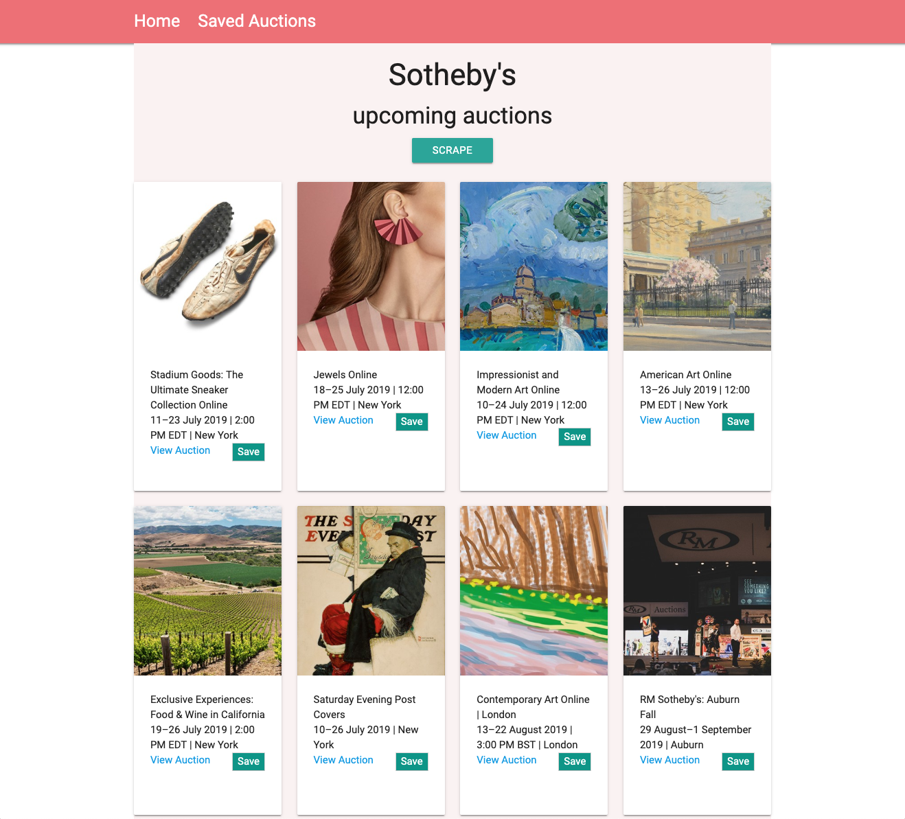

# Art Calendar

[upcoming Sotheby's auctions](https://www.sothebys.com/en/calendar?locale=en#searchModule)<br>
=> possibility to save auctions that interests you the most and to comment on them



## Technologies used

* HTML/ CSS
* Materialize
* Javascript
* node.js
* mongoDB

## Node package used

1. [Express.js](https://www.npmjs.com/package/express)
2. [Handlebars](https://handlebarsjs.com/)
3. [Mongoose](https://www.npmjs.com/package/mongoose)
4. [Axios](https://www.npmjs.com/package/axios)
3. [cheerio](https://www.npmjs.com/package/cheerio) to scrape 

> web scraping is a technique employed to extract data from a website. 

```javascript
axios.get("https://www.sothebys.com/en/calendar").then(function (response) {
        var $ = cheerio.load(response.data);


        $(".Card").filter(function(i, element){
            return $(this).children(".Card-info").children(".Card-info-container").attr("href") != undefined
        }).each(function (i, element) {
            var result = {};

            result.media = $(this).children(".Card-media").find("img[data-style=portrait]").first().attr("data-src");
    
            var cardInfo = $(this).children(".Card-info").children(".Card-info-container");
            result.link = cardInfo.attr("href");
            result.title = cardInfo.children(".Card-title").text();
            result.details = cardInfo.children(".Card-details").text();


            db.Article.create(result)
                .then(function (dbArticle) {
                    console.log(dbArticle);
                })
                .catch(function (err) {
                    console.error(err);
                });
        });

```


## Author
Victoire Baron